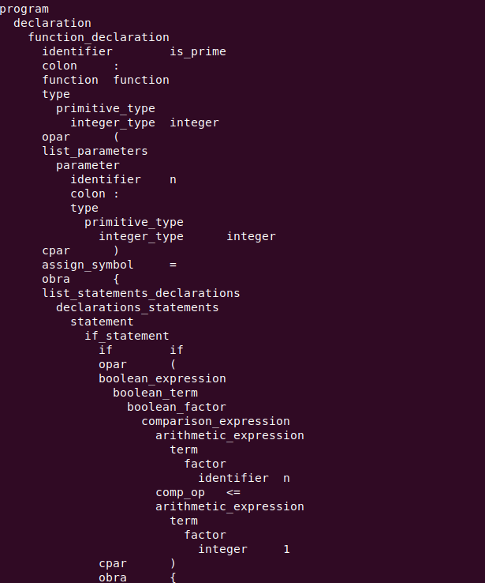

# B Language Compiler

This project is about building a compiler for the B language, implemented in Python, which translates .b source code into x86_64 assembly code under Linux. However, note that though the actual execution of the generated .s code should be executed on x86_64 linux platforms, the genration of the .s can take place on any platform. The compiler consists of three main parts: the Front End, the Middle End, and the Back End. Before we actually jump into the code presentation, let present first the structure of the project folder as illustrated by the Figure 1 below.
## Authors
This project was executed in Python by Volgan and Sylvain.
## Project Structure

- **compiler.py**: module containg the main class of the compiler orchestrating the different compilation stages.
- **front_end.py**: module containing the FrontEnd class for lexical and syntactical analysis and abstract syntax tree construction.
- **middle_end.py**: module containing the MiddleEnd class for semantic analysis, optimization, and intermediate representation generation.
- **back_end.py**: module for generating the final .s assembly code.
- **utils.py**: Utility file containing helper classes and functions like file management and data structures.
- **b_grammar.gr**: File containing a Turing-complete grammar for the b language
- **requirements**: File containing the python dependency requirements
- **tests**: Folder containing the tests

<p align=center>
</img>
</p>
<p align=center>
<em>Fig.1: Structure of project folder</em>
</p>

## Grammar
The proposed b grammar specification, as shown below by Figure 2, is turing-complete. However, it does not offer all the flexibility to user when writing programs. For instance :
- **incrementation writing-style**: incrementation i++ should be rewritten as i=i+1.
- **declaration in for header**: variables can be declared anywhere except when mixing it in the for statement header such as for(int i=).
- **constant arrays**: to initialiaze with constant arrays, the value must be assigned element by element. for instance, instead of arr: [] integer={1,3}, rather do arr[0]=1 and arr[1]=3.
- **comments**: comments are not handled
```console
program: (declaration)*
declaration: variable_declaration | function_declaration 
variable_declaration: identifier colon type semicolon |  identifier colon type assign_symbol expression semicolon | identifier colon array osbra integer csbra type semicolon
function_declaration: identifier colon function type opar list_parameters cpar assign_symbol obra list_statements_declarations cbra
type: primitive_type
primitive_type: char_type | integer_type | string_type | boolean_type | float_type | void_type
list_parameters: [(parameter comma)* parameter]
...
```
<p align=center>
<em>Fig.2: A turing-complete grammar specification for b language</em>
</p>

## Requirements
- **lark**: A python library for lexical and syntactical analysis in the Front End.
- **json**: A python library for converting complex data structures into strings.

## Front End

The Front End handles the initial phase of compilation. That is, itreads a b-program, checks that it is grammatically correct, and if correct returns the corresponding abstract syntax tree:

- **Lexical Analysis**: Converts the source code into a stream of tokens.

<p align=center>
</img>
</p>
<p align=center>
<em>Fig.3: Tokens from lexical analysis</em>
</p>

- **Syntactical Analysis**: Checks that the sequence of tokens follow the defined grammar and subsequently generates the abstract syntax tree if the checking was successful.
<p align=center>
</img>
</p>
<p align=center>
<em>Fig.4: AST from syntactical analysis</em>
</p>


## Middle End

The Middle End performs semantic analysis and optimization:

- **Semantic Analysis**: Ensures semantic correctness of the program. It encompasses (1) checking type composition consistency (e.g., adding string and integer), (2) checking types during assignment (e.g., assigning boolean to integer), (3) checking types of parameters during function call (e.g., providing 2 parameters instead of 3 or same parameters with different types)
, (4) checking types of control expressions and statements in for-loop (e.g., stop-condition expression must be boolean), (5) checking types of control expressions in if-blocks (e.g., if-condition expression must be boolean), (6) checking types of array index (e.g., index expressions must be of type integer), (7) checking types of return, (8) checking illegal use of identifier as function, array, constant and variable
- **Optimization**: Improves the code by  (1) propagating constants at the global scope, and (2) eliminating dead codes (e.g., codes after return statement).
- **Intermediate Representation**: The optimized intermediate representation of the code, such as shown by Figure 5, comprises of a rich symbol table containing good amount of semantic information on symbols found in the code as well as a so-called indexed AST in which symbols are grounded into symbol table. 
<p align=center>
</img>
</p>
<p align=center>
<em>Fig.5: Optimized intermediate representation from semantic analysis. (left) Symbol table, (right) grounded AST</em>
</p>

## Back End

The Back End generates the final assembly code:

- **Code Generation**: Converts the intermediate representation into x86_64 linux assembly code.
- **Optimization**: improves the code by using optimal registers and operators (e.g., MOVQ for moving addresses (8 bytes) and MOVL for moving integers (4 bytes). Using ADDB for adding bytes instead of ADDQ designed for adding 8-byte numbers like doubles, ... )
- **Output**: Writes, as illustrated by Figure 6, the assembly code to an .s file ready to be translated in machine code and executed.
<p align=center>
</img>
</p>
<p align=center>
<em>Fig.6: Generated .s code fro x86_64 linux target platforms</em>
</p>

## Usage

### 1. Compiling from .b to .s code

The compiler can be exploited in two manner as end program and as library.
#### a. Using compiler as end program
To compile a .b source file when using the compiler as end program, use the console as follows (also see Figure 7):

```console
username@hostname:~$ ./path_to_project_foler/compiler.py path_to_b_source_file
```

<p align=center>
</img>
</p>
<p align=center>
<em>Fig.7: Compiling on the terminal while using the compiler as end program</em>
</p>

It is important to note that compiler.py is set on the OS as executable. This can be achieved as follows

```console
username@hostname:~$ chmod +x ./path_to_project_foler/compiler.py
```
#### b. Using compiler as library
To use the compiler as library, the module compiler.py should be imported and the class Compiler instantiated as follows:

```python
from Compiler import Compiler

compiler = Compiler(grammar_file='b_grammar.gr')
input_source_file = "path/to/your/file.b"
compiler.run(input_source_file=input_source_file)
```
The .s ouput file has the same pathname as the input file except the extension that changes.

### 2. Compiling from .s to executable

Once the .s code generated by the compiler, other software such as gcc can be used as shown by Figure 8 to generate an executable. This is very important for testing whether the back end is syntactically working well. **Note again that the target platform should be x86_64 linux**.

<p align=center>
</img>
</p>
<p align=center>
<em>Fig.8: Compiling from .s to executable with gcc</em>
</p>

### 3. Running the executable

The generated executable can then be executed as presented by Figure 9. This is important to check whether the back end is semantically working well.

<p align=center>
</img>
</p>
<p align=center>
<em>Fig.8: Executing the generated executable</em>
</p>


